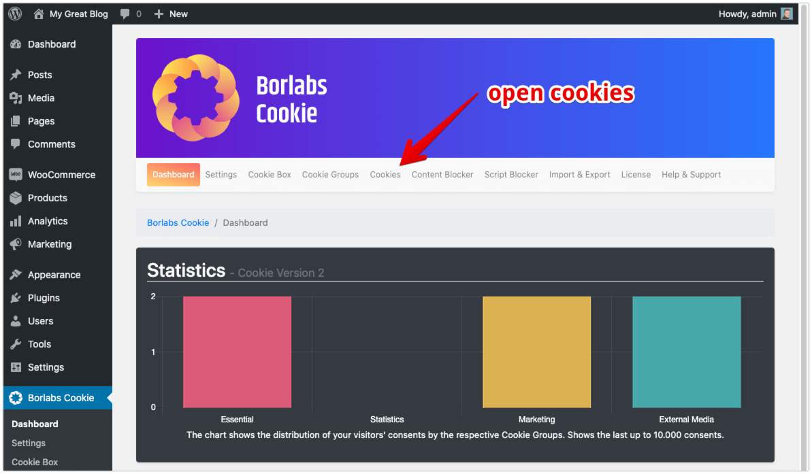
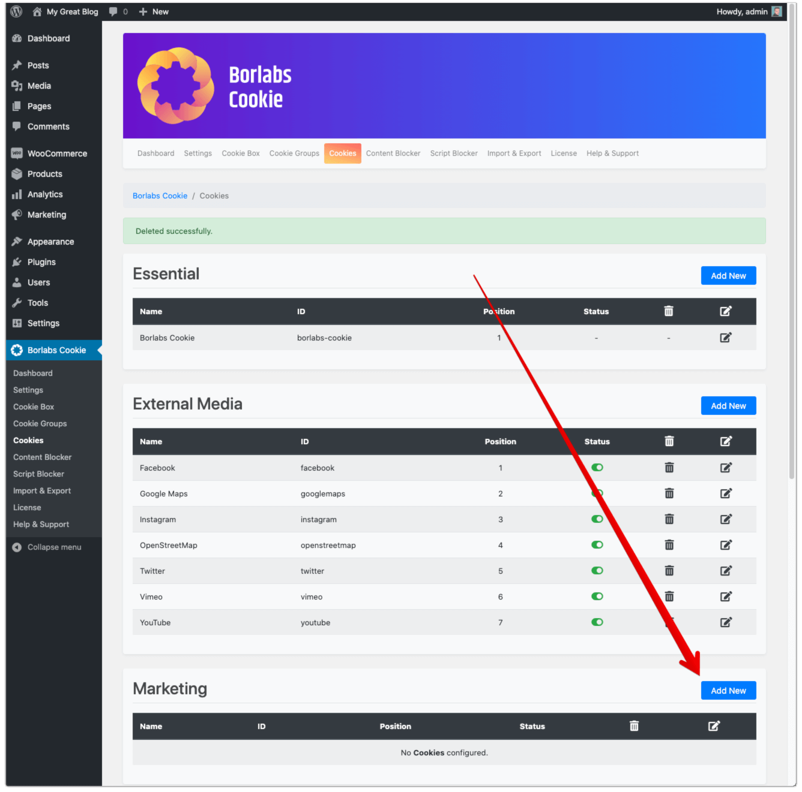
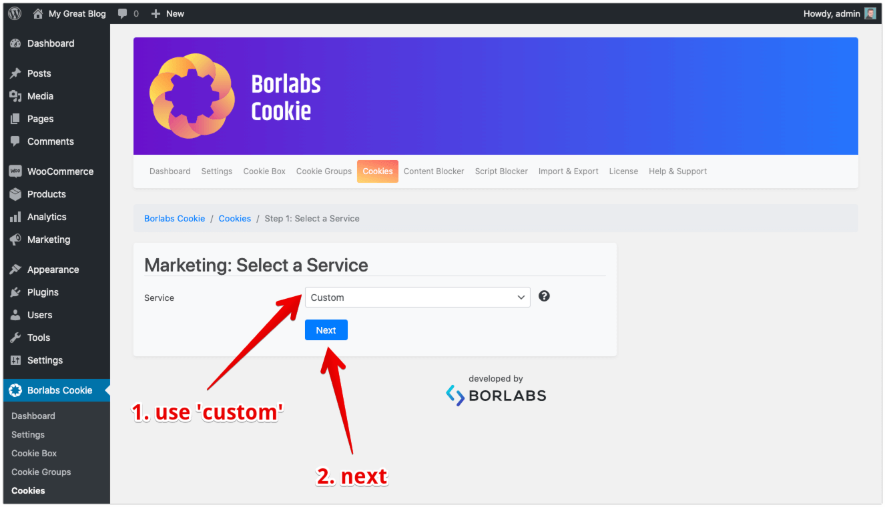
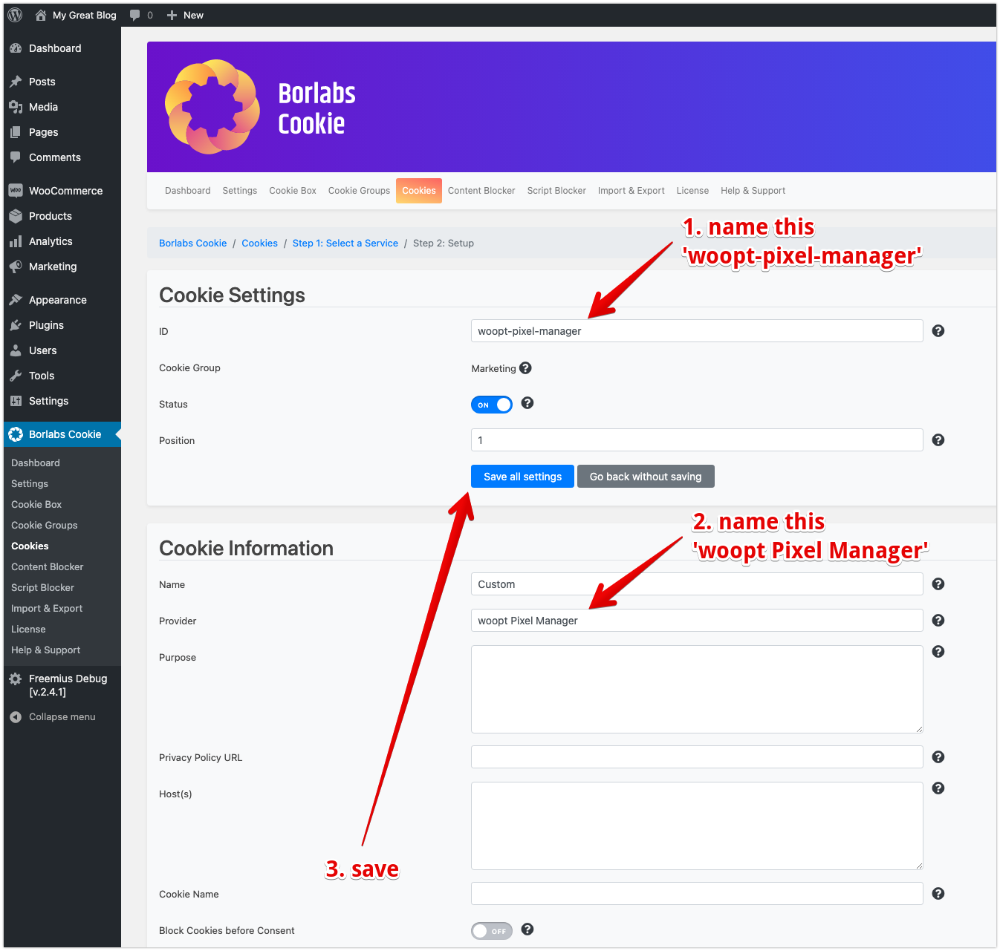

# Borlabs Cookie

## Setup for explicit consent

!> This requires at least Borlabs Cookie version 2.1.0

?> The following procedure explains how to set up our plugin and Borlabs Cookie in order to only fire the conversion pixels in case explicit consent has been given by the visitor. 

!> Make sure to disable Script Blocker settings in Borlabs

This is a two step process:

- Disable the pixel injection by default by adding the following code to your function.php file in your child theme: 

`add_filter( 'wgact_cookie_prevention', '__return_true' );`

- Add a marketing cookie for woopt Pixel Manager to Borlabs Cookie as follows: 

Now your shop is ready. Only in case the visitor has given consent to that marketing cookie, it will be injected by our plugin.