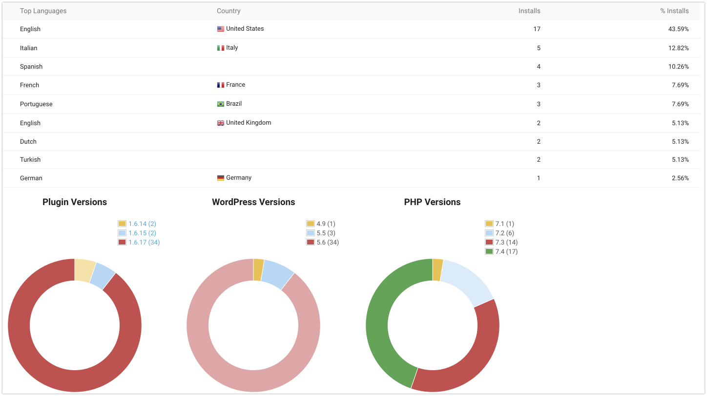

# FAQ

## What is the new "opt in" feature in your plugin? Opt in to what?

We started to collect telemetry from users who are willing to share some data with us, like WooCommerce, WordPress and PHP versions, or the shop language:

 

 
image (Click to expand)

 
 

This will help us to better prioritize our development roadmap for the plugin. For example we’ve been working on translations recently and didn’t know which ones would be the most important ones (the ones with the highest user count). Unfortunately the wordpress.org repository doesn’t provide us much data about that.  

Also we will invest more time to build even more useful features and possibly add some pro features too.

If you wish to help us on this way, you can opt in, but it is absolutely voluntary and won’t change how the plugin works in any way. 

## The number of conversions counted in Google Ads are less than what's actually reported in my shop. Why?

There's a number of reasons.

1. Google Ads only counts conversions that have been triggered by an ad. 
2. The conversion window of Google Ads is typically 30 days (can be customized). That means Google Ads only counts conversions of clicks that happened during that time. 
3. If you compare Google Ads to Google Analytics, you also will not see the same numbers, as both have a different standard approach on measuring conversions: https://support.google.com/analytics/answer/2679221

## What if a user refreshes the the thankyou page multiple times, does it recount? How do you handle duplication?

We also transmit the transaction id to Google Ads. This helps Google Ads to deduplicate all conversions that have been transmitted more than once. 

This process doesn't run immediately in Google Ads but over a period of several hours after the conversion. So it might happen, that you will see a recent conversion duplicated but then fixed a few hours later. 

## I see issues in the backend of my shop. Admin pages get rendered weird, and popups don't go away when I click to close them. How can I fix this?

You probably have some script or ad blocker activated. Deactivate it and the issues should go away. Usually you can disable the blocker for just that particular site (your WooCommerce back end).

Our plugin injects tracking pixels on the front end of WooCommerce shops. As a consequence scripts of our plugin have been added to some privacy filter lists. The idea is to prevent the scripts running if a shop visitor has some ad blocker enabled and wants to visit the front end of the shop. This is totally ok for visitors of the front end of the shop. But, it becomes an issue for admins of the shop who have a blocker activated in their browser and visit the backend of the shop.

Unfortunately there is no way for us to generally approve our scripts in all blockers for the WooCommerce back end.

Therefore we recommend admins of the shop to exclude their own shop from the blocker in their browser.

## When I open the plugin settings, I see a warning flashing that goes away after half a second or so. What is this?

In rare cases scripts, that we use to render the settings page, get blocked. We use those scripts to make the interface faster and more useful. Without those scripts, the settings page would look horrible. And the reason why those scripts sometimes get blocked are ad-and script-blockers that have been installed in the browser of some of the users. [Learn more](https://docs.woopt.com/wgact/#/script-blockers)

The warning that you see is only intended to be seen by those people who have an active script-blocker. The only way I have come up with yet, to detect if a script blocker is running, is the following:

In the first step I output the warning into the HTML source of **everyone** who is accessing the page. And then, in second step, I hide the warning with a script. **This second step will only work for users who have no script blocker running.** It is the safest way to be sure that the warning will be seen by users with script blockers. But this method has a downside. If the server is a bit slow, the scripts for  people who **don't have a script blocker running** get loaded slow and therfore it takes half a second or so, until the warning gets hidden. 

If this happens to you, you can safely ignore the warning, since it means that no script blocker is running and all is rendered correctly. 