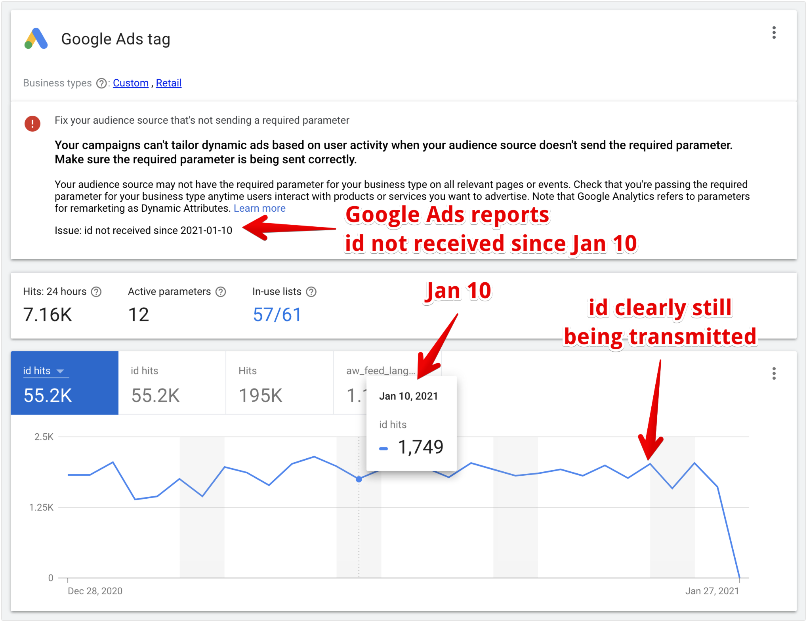
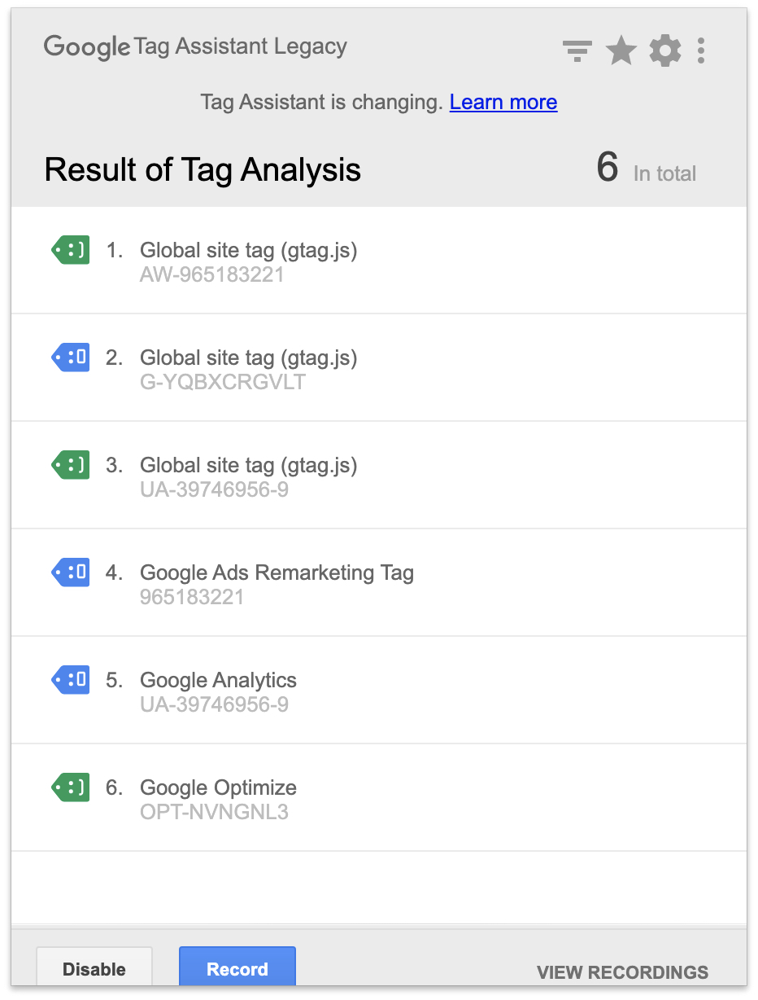

# FAQ

## What is the new "opt in" feature in your plugin? Opt in to what?

We started to collect telemetry from users who are willing to share some data with us, like WooCommerce, WordPress and PHP versions, or the shop language:

 

 
image (Click to expand)

 
 

This will help us to better prioritize our development roadmap for the plugin. For example we’ve been working on translations recently and didn’t know which ones would be the most important ones (the ones with the highest user count). Unfortunately the wordpress.org repository doesn’t provide us much data about that.  

Also we will invest more time to build even more useful features and possibly add some pro features too.

If you wish to help us on this way, you can opt in, but it is absolutely voluntary and won’t change how the plugin works in any way. 

## The number of conversions counted in Google Ads are less than what's actually reported in my shop. Why?

There's a number of reasons.

1. Google Ads only counts conversions that have been triggered by an ad. 
2. The conversion window of Google Ads is typically 30 days (can be customized). That means Google Ads only counts conversions of clicks that happened during that time. 
3. If you compare Google Ads to Google Analytics, you also will not see the same numbers, as both have a different standard approach on measuring conversions: https://support.google.com/analytics/answer/2679221

## What if a user refreshes the the thankyou page multiple times, does it recount? How do you handle duplication?

We also transmit the transaction id to Google Ads. This helps Google Ads to deduplicate all conversions that have been transmitted more than once. 

This process doesn't run immediately in Google Ads but over a period of several hours after the conversion. So it might happen, that you will see a recent conversion duplicated but then fixed a few hours later. 

## I see issues in the backend of my shop. Admin pages get rendered weird, and popups don't go away when I click to close them. How can I fix this?

You probably have some script or ad blocker activated. Deactivate it and the issues should go away. Usually you can disable the blocker for just that particular site (your WooCommerce back end).

Our plugin injects tracking pixels on the front end of WooCommerce shops. As a consequence scripts of our plugin have been added to some privacy filter lists. The idea is to prevent the scripts running if a shop visitor has some ad blocker enabled and wants to visit the front end of the shop. This is totally ok for visitors of the front end of the shop. But, it becomes an issue for admins of the shop who have a blocker activated in their browser and visit the backend of the shop.

Unfortunately there is no way for us to generally approve our scripts in all blockers for the WooCommerce back end.

Therefore we recommend admins of the shop to exclude their own shop from the blocker in their browser.

## When I open the plugin settings, I see a warning flashing that goes away after half a second or so. What is this?

In rare cases scripts, that we use to render the settings page, get blocked. We use those scripts to make the interface faster and more useful. Without those scripts, the settings page would look horrible. And the reason why those scripts sometimes get blocked are ad-and script-blockers that have been installed in the browser of some of the users. [Learn more](https://docs.woopt.com/wgact/#/script-blockers)

The warning that you see is only intended to be seen by those people who have an active script-blocker. The only way I have come up with yet, to detect if a script blocker is running, is the following:

In the first step I output the warning into the HTML source of **everyone** who is accessing the page. And then, in second step, I hide the warning with a script. **This second step will only work for users who have no script blocker running.** It is the safest way to be sure that the warning will be seen by users with script blockers. But this method has a downside. If the server is a bit slow, the scripts for  people who don't have a script blocker running get loaded slow and therfore it takes half a second or so, until the warning gets hidden. 

If this happens to you, you can safely ignore the warning, since it means that no script blocker is running and all is rendered correctly. 

## In the Google Ads audience manager I see the warning `ecomm_prodid never received`. Why?

> The plugin uses the newest version of the Google Ads dynamic data tracking code, which doesn't use the `ecomm_prodid` parameter anymore. This parameter was replaced with the `view_item` and `items` parameters. [Google specifications](https://support.google.com/google-ads/answer/7305793)

If you see the warning, this could have several causes. 

- You haven't set up the plugin correctly yet. You will need to enable dynamic remarketing within the plugin. Only then that tracking code will be injected. 
- You made the switch from the old to the new tracking code just recently. In that case, Google will need a few days before it picks up the new parameters and removes the warning.
- Google Ads is reporting a false warning. The report shows, that a parameter is missing, but in fact it is being transmitted and received by Google Ads. Look at the following example:
 

 
image (Click to expand)

 
 

If the warning doesn't go away, please reach out to us and aks for support.

## Google Tag Assistant reports multiple installations of Global site tag (gtag.js) detected. What shall I do?

?> This warning is of very low severity. It can be safely ignored.

There are two main reasons, why this warning pops up. 

- You have activated more than one Google service, such as Google Ads and Google Analytics. During initialization `gtag.js` is configured once for each service. Google Tag Assistant detects this as separate global site tag, but it should not. It is safe to ignore that warning. 

We implemented this exactly as [specified by Google](https://developers.google.com/gtagjs/reference/api). 

 

 
image (Click to expand)

 
 

- Some other plugin also injects a `gtag` source file into the HTML output of the page. As a consequence, the `gtag` namespace will be declared two times. Technically this is no problem, as they both initialize exactly the same namespace. So one just overwrites the other. Therefore it is safe to ignore that warning. 

## No conversions are being reported in Google Ads

There are several possible reasons why this can happen: 

- It can take up to 48 hours before the conversion appears in Google Ads
- Either the conversion ID or the conversion label or both are wrong
- Google Ads only shows conversions which were triggered through an ad click. Please follow these testing procedures exactly: [How to test conversion tracking](https://docs.woopt.com/wgact/#/test-order)
- If you are using caching you must make sure to exclude the purchase confirmation page
- If you are using minification plugins, turn them off and try again. Some minification plugins break the conversion code
- Users who disabled JavaScript or users who are blocking cookies (eg. with ad blockers) can't be tracked
- Cookie Management Platforms (cookie banners) might be blocking the conversion tracking
- Off-page payment gateways need to be configured to redirect back to the purchase confirmation page. If that's not set up correctly, or if a user interrupts the redirect, no conversion is reported. 

## Not all conversions are being reported

Unfortunately it is not possible to track 100% of all conversions. There are several possible reasons why this can happen: 

- Some users might be using Brave browser (that blocks all trackers by default) or strict privacy settings in other browsers.
- Some users might be using privacy-enhancing browser extensions that block Google Analytics and Google Tag Manager. Adblockers and other privacy-related browser extensions.
- Browsers with strict privacy settings.
- JavaScript disabled in a browser.
- Cookie Management Platforms (cookie banners) might be blocking the conversion tracking
- Off-page payment gateways need to be configured to redirect back to the purchase confirmation page. If that's not set up correctly, or if a user interrupts the redirect, no conversion is reported. 

## The dismiss button doesn't work. Why?

You are using some kind of ad- or script-blocker in your browser. It blocks the script in our plugin that is responsible to dismiss the notification. 

You have the following options:

- Temporarily disable the ad- / script-blocker in your browser and then dismiss the notification. 
- Whitelist our scripts in the ad- / script-blocker.
- Switch to a different ad- / script-blocker. Not all of them block our scripts.

> We recommend to whitelist our scripts because they are also required on the plugin's settings page.

?> You might wonder why our scripts, but no others, get blocked by the ad- / script-blocker. The reason is that our plugin helps tracking conversions for various ad platforms. And apart of blocking ads, many ad blocking service providers also block scripts that help track visitors and conversions. Because many of those providers are unable to distinguish if the scripts are being used for the front-end or the back-end, they simply block the scripts also on the back-end, thus triggering the issue you are facing. We've spend a considerable amount of time to remove our plugin from the ad- and script-blockers. In some cases we succeeded, it others we did't.

## Why is tracking accuracy so important?

You might ask yourself why tracking accuracy is important and why it can be low. 

If for some reason only 20% of the visitors and conversions can be tracked, then paid ads platforms like Google Ads only get 20% of the data that they could get. Such a low accuracy prevents campaigns to run optimally. Actually, the difference in campaign performance can be as large as day and night. We've seen revenues and profit margins more than double in certain cases, just by fixing the visitor and conversion tracking. It doesn't mean that accurate conversion tracking makes every campaign high performing and profitable. But it will give you the best shot possible. 

Here a few (of many) possible reasons why the accuracy can be low:

- Using off-site payment gateways
- Misconfigured cookie consent banners
- Custom purchase confirmation pages that don't properly follow WooCommerce specifications