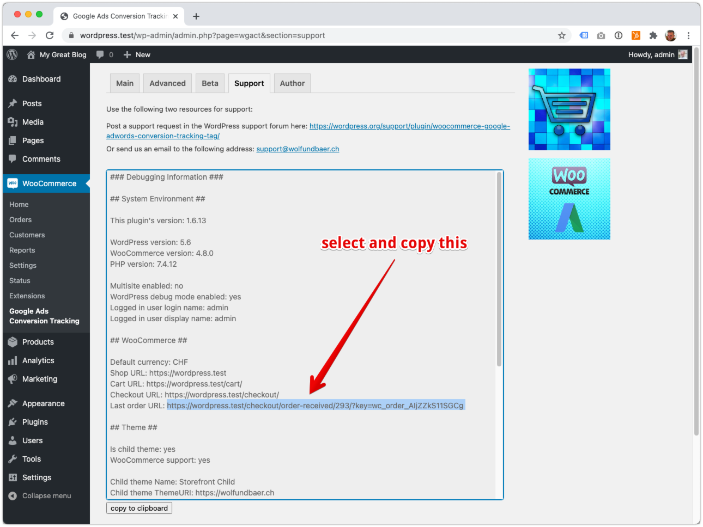
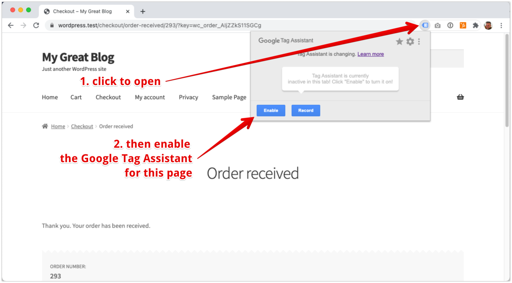
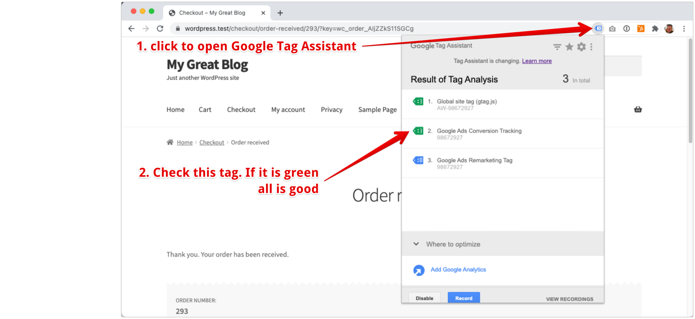

### Test with Google Tag Assistant

> Install Google Tag Assistant from here [Google Tag Assistant Extension](https://chrome.google.com/webstore/detail/tag-assistant-by-google/kejbdjndbnbjgmefkgdddjlbokphdefk)

1. Head over to the support section of our plugin
2. Look at the debug info window and copy the "Last order URL"

 

 
image (Click to expand)

 
 

3. Log out of the shop
4. Open the "Last order URL" in a new tab or window
5. Enable the Google Tag Assistant for this page

 

 
image (Click to expand)

 
 

6. Reload the page
7. Check the conversion tag

 

 
image (Click to expand)

 
 

?> Checking the conversion tag this way will only confirm that the tag fires correctly and that data is transmitted to Google. But, if you haven't set the correct conversion id and label, the conversion will never reach your Google Ads account. Make sure to set the correct conversion id and label too.