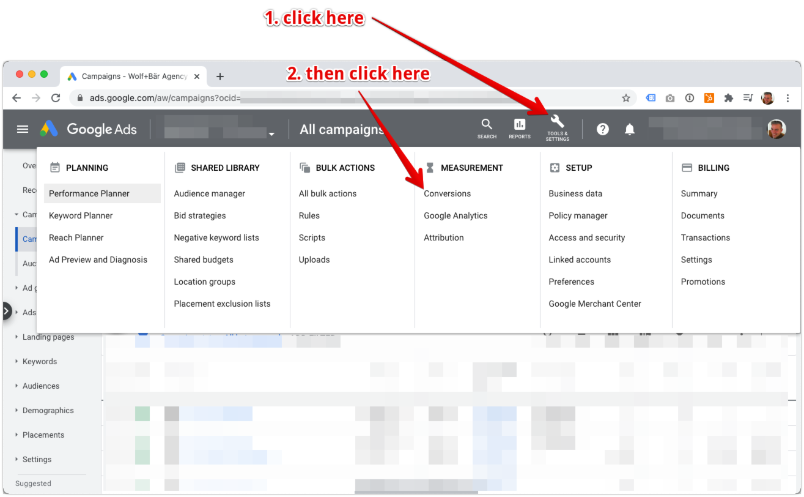
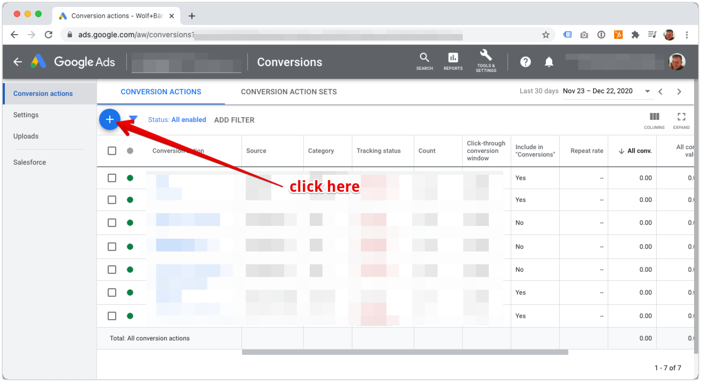
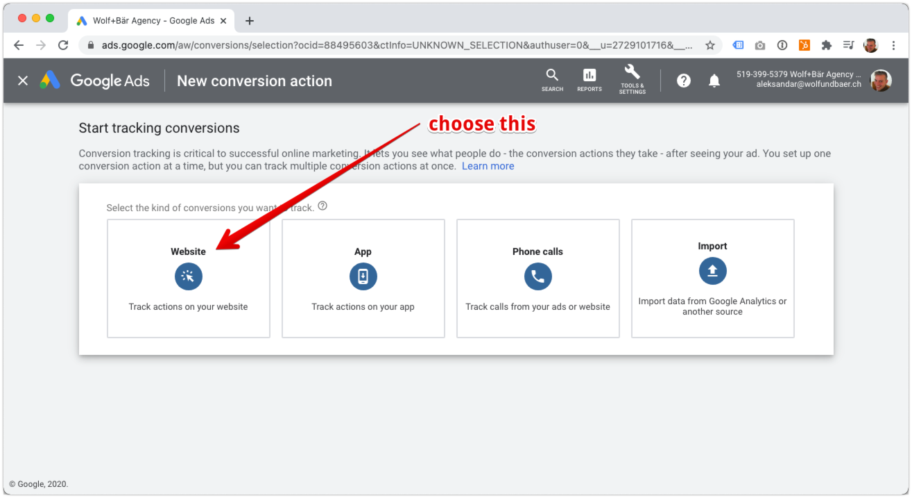
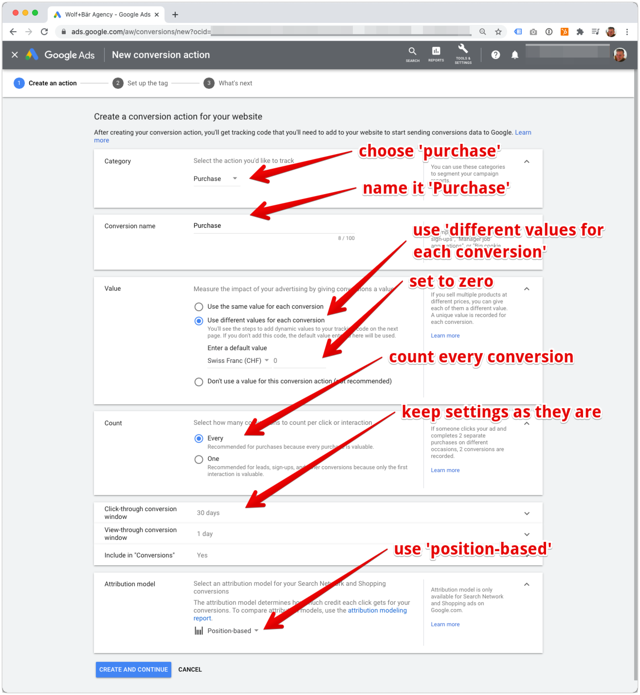
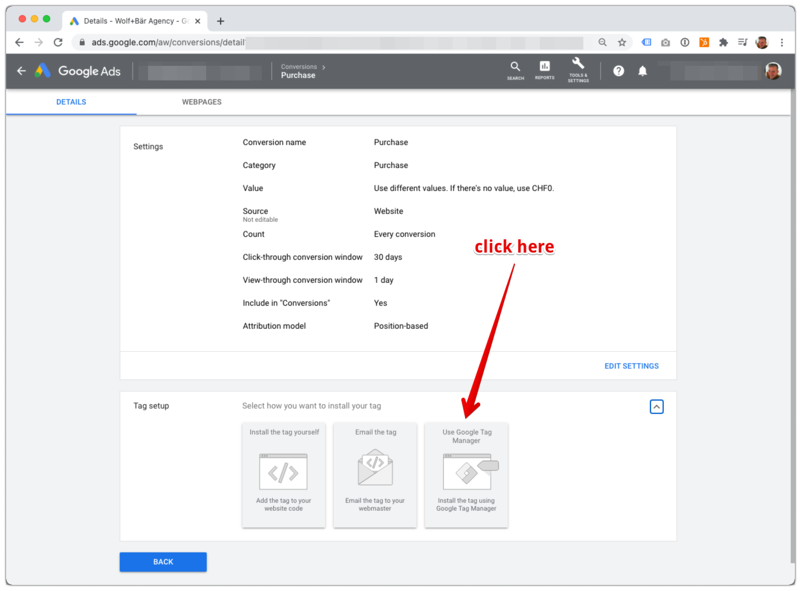
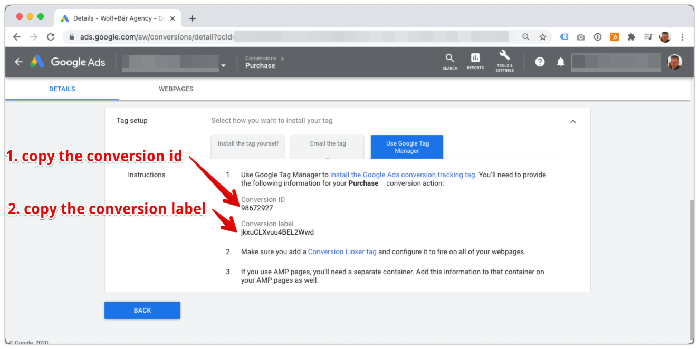
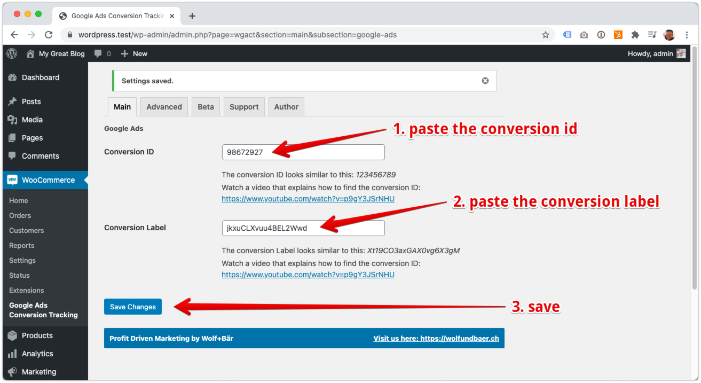
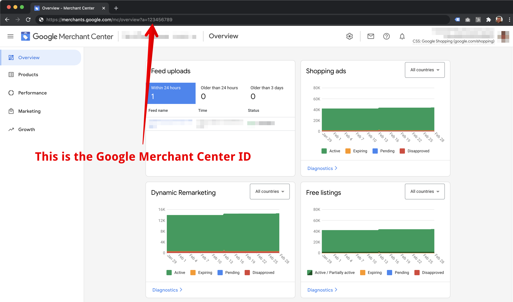

# Google Ads

## Create a new conversion in Google Ads

>How to set up a purchase conversion in Google Ads

?> Skip this step, if you've already created a purchase conversion in Google Ads

1. Open Conversions in Google Ads

    

    
image (Click to expand)

    
    

2. Initiate a new conversion creation

    

    
image (Click to expand)

    
    

3. Choose conversion type "Website"

    

    
image (Click to expand)

    
    

4. Configure the Google Ads conversion settings

 Use the following default settings. Only change if you know what you're doing. 

 - Category: Purchase
 - Conversion name: Purchase
 - Value: Use different values for each conversion
 - Default value: zero
 - Count: Every
 - Attribution: Position-based

  

  
image (Click to expand)

  
  

## Configure the plugin

>How to find and set the conversion ID and conversion label

1. Get the conversion id and conversion label

 Open the purchase conversion in Google Ads.

 

  
image (Click to expand)

 
  

 Copy the purchase conversion id and label from the Google Tag Manager tab.

 

  
image (Click to expand)

 
  

 2. Set the conversion id and label in the plugin

  
image (Click to expand)

 
  

## Conversion Cart Data

>This features adds another level of detail to the purchase conversion. Along the conversion value it will add information about the items sold. In return you will see more detailed revenue metrics for the Google Shopping campaigns.

**Benefits**
- Detailed reporting on items sold
- Clear measure of revenue and profit generated by Shopping Ads
- Detailed reporting on cart size and average order value

Google support article on [Conversion Cart Data](https://support.google.com/google-ads/answer/9028254)

**Setup**

Enable this feature by saving the Google Merchant Center ID in the plugin. 

You can find the Google Merchant Center ID in the URL after you log into the [Google Merchant Center](https://merchants.google.com/). 

  
image (Click to expand)

 

