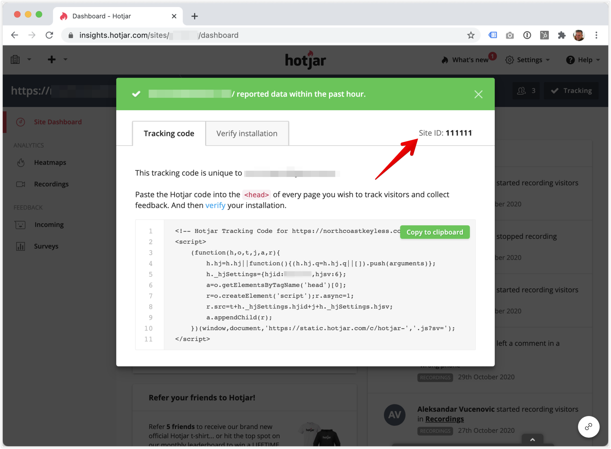

# Hotjar

### Hotjar site ID

?> Setting up the Hotjar pixel is very simple. After you open your Hotjar account for your site, you only need to click on the `Tracking`button in the top right and copy the `ID`. This is the `Hotjar site ID` which you'll have to set in the plugin. 

1. Open you Hotjar account
2. Click on the `Tracking` button on the top right
3. Copy the `ID` and past it into the plugin

    

    
image (Click to expand)

    
    
