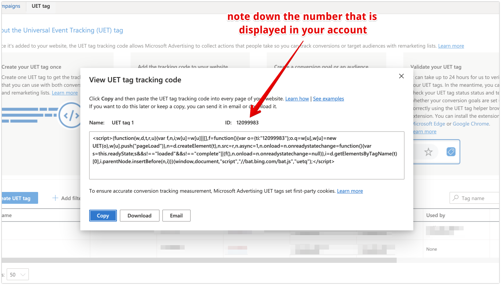
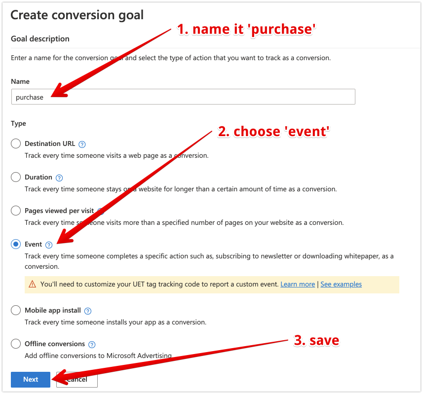
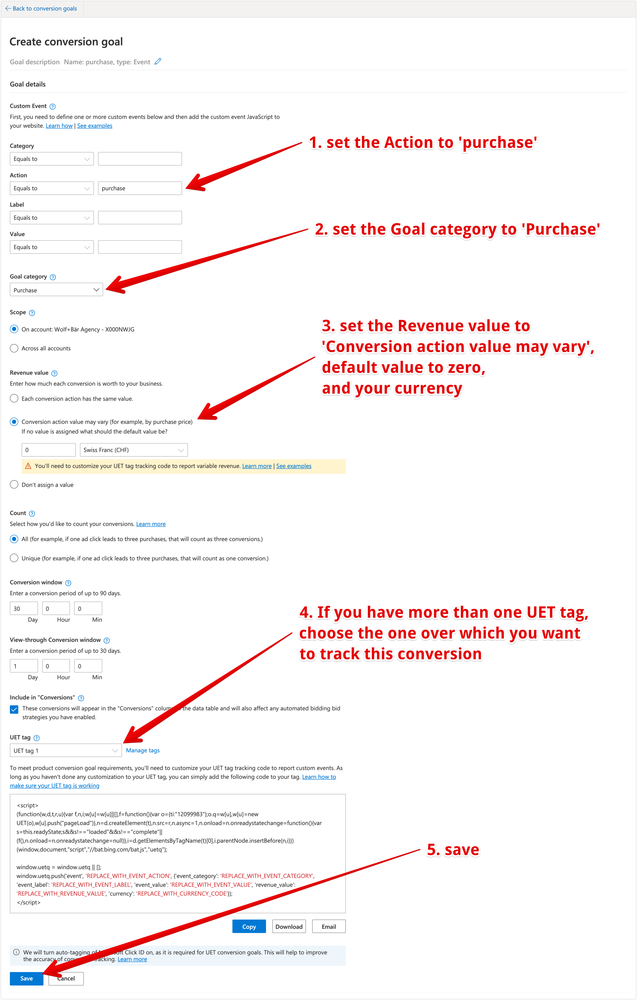

## Microsoft Advertising (Bing Ads)

### Setting up the UET tag

?> You can skip this step, if you already have an UET tag. We only need one active UET tag.

1. Log into your Microsoft Advertising account.
2. In the menu click -> Tools -> Conversion tracking -> UET tag.
3. Click -> create UET tag.
4. Give it some meaningful name like `UET tag 1`.
5. Save it.
6. A window pops up with the UET tag code. You only need to note down the `ID`. This is the Microsoft Advertising `UET tag ID`.
7. Copy and paste that `UET tag ID`into the plugin.

    

    
image (Click to expand)

    
    

### 2. Setting up the purchase conversion

?> We will set up a new purchase conversion goal, using a purchase **event**. It is different in the way, that we don't use a destination URL (like in most setup guides), but by using a purchase event. It is much less error prone and works equally well. 

1. In the menue click -> Tools -> Conversion tracking -> Conversion goals.
2. Click -> Create conversion goal.
3. Give it a meaningful name like `purchase` and choose `event` as type. 

    

    
image (Click to expand)

    
    

4. Set the following settings.

?> Unless we instruct otherwise, keep the default settings. 

 - Custom Event: `Action` is `Equals to` `purchase`
 - Goal category: `Purchase`
 - Revenue value: `Conversion action value may vary` with value of `0`and the currency of your choice
 - UET tag: The UET tag that we've set up in step one (Setting up the UET tag).

    

    
image (Click to expand)

    
    

