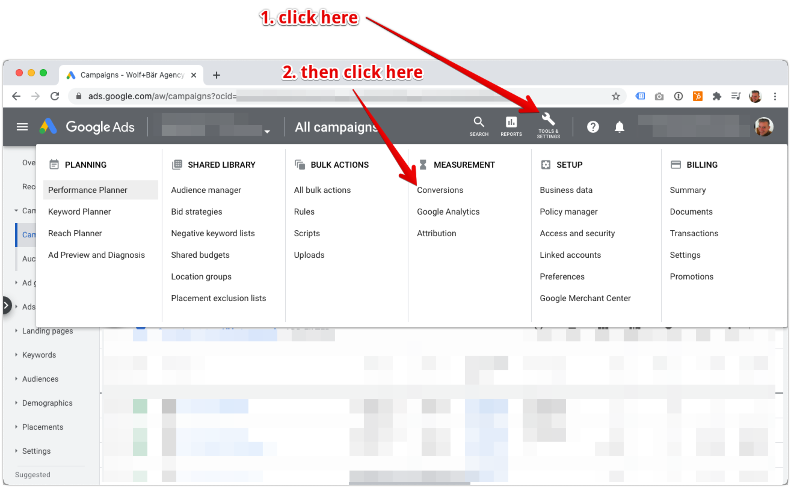

# Plugin configuration

## Create a new conversion in Google Ads

?> You can skip this step, if you've already created a purchase conversion in Google Ads

1. Open Conversions in Google Ads

    

    
image (Click to expand)

    
    

2. Initiate a new conversion creation

    

    
image (Click to expand)

    
    

3. Choose conversion type "Website"

    

    
image (Click to expand)

    
    

4. Configure the Google Ads conversion settings

 Use the following default settings. Only change if you know what you're doing. 

 - Category: Purchase
 - Conversion name: Purchase
 - Value: Use different values for each conversion
 - Default value: zero
 - Count: Every
 - Attribution: Position-based

  

  
image (Click to expand)

  
  

## Cofigure the plugin

1. Get the conversion id and label

 Open the purchase conversion in Google Ads.

 

  
image (Click to expand)

 
  

 Copy the purchase conversion id and label from the Google Tag Manager tab.

 

  
image (Click to expand)

 
  

 2. Set the conversion id and label in the plugin

  
image (Click to expand)

 
  

