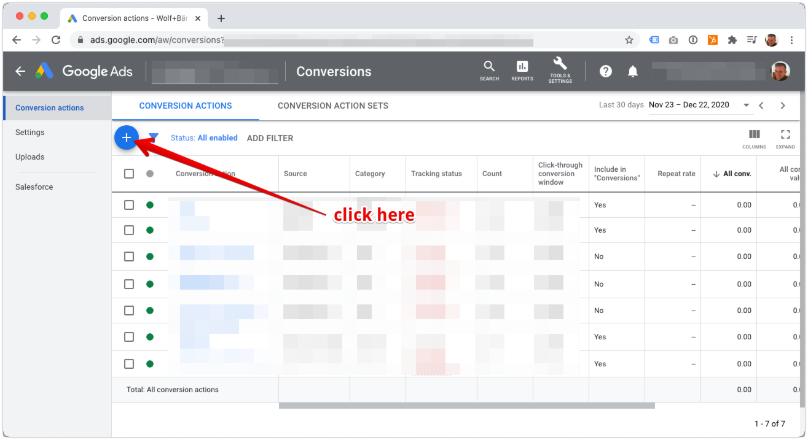
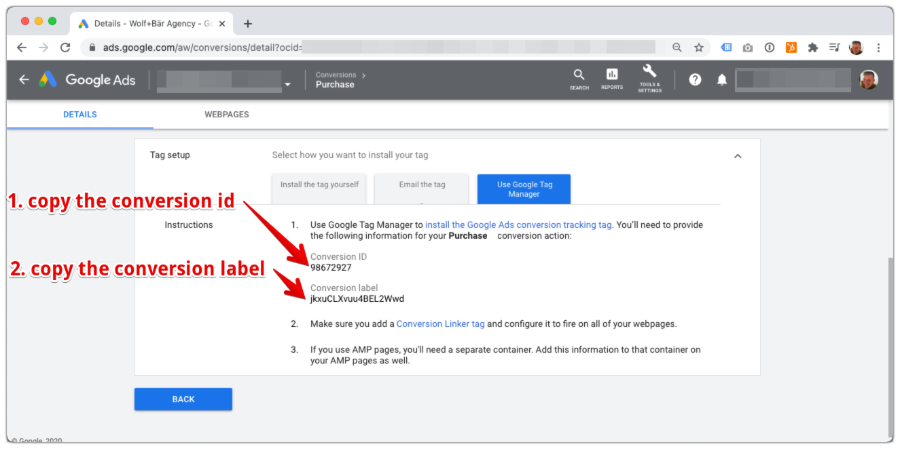
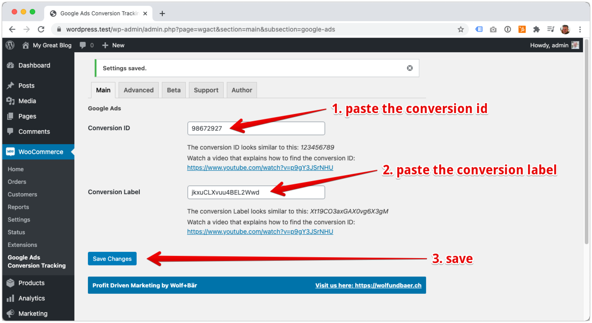

# Plugin configuration

## A) Create a new conversion in Google Ads

?> You can skip this step, if you've already created a purchase conversion in Google Ads

### 1. Open Conversions in Google Ads

### 2. Initiate a new conversion creation

### 3. Choose conversion type

### 4. Configure the Google Ads conversion settings

## B) Cofigure the plugin

### 1. Get the conversion id and conversion label

Open the purcahse conversion in Google Ads.

