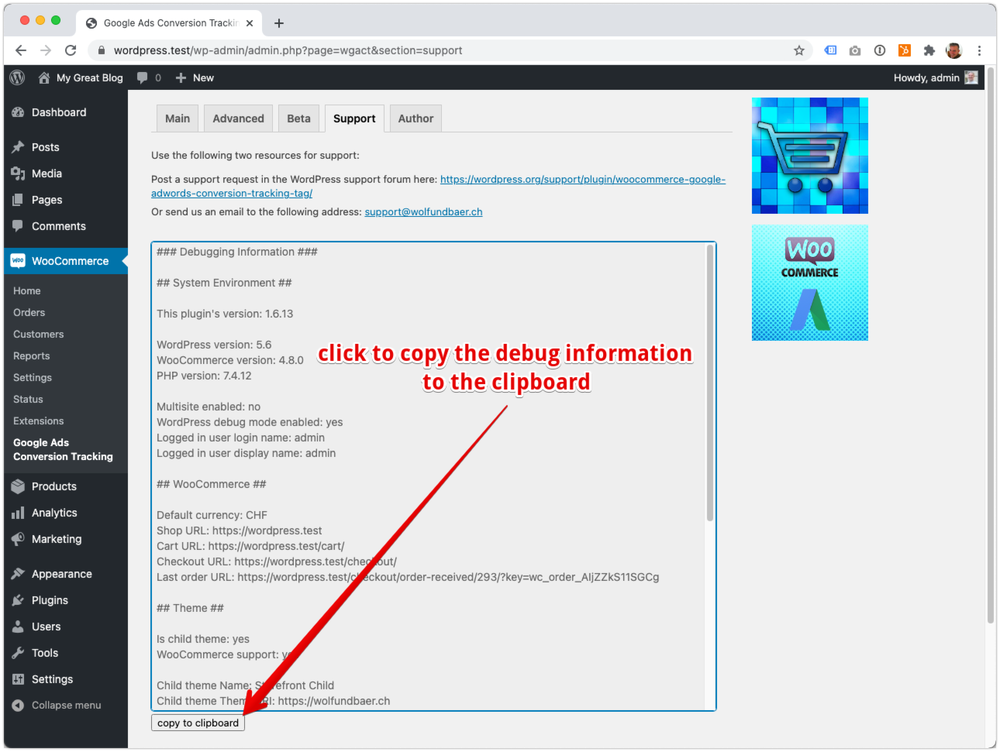

### Where can I report a bug or suggest improvements?

Please post your problem in the WordPress support forum for this plugin: [Support forum](https://wordpress.org/support/plugin/woocommerce-google-adwords-conversion-tracking-tag)

Alternatively you can sent a request to [support@wolfundbaer.ch](mailto:support@wolfundbaer.ch). If you do, please copy and paste the debug info from our plugin and attach it to the email. 

image (Click to expand)

### The most common issues in case the pixels don't work

- Caching: If you run some caching layer, the server might still serve cached versions of the pages. You will need to delete the cache.
- Minification, combination and concatenation: Some minification and combination plugins mangle up the injected JavaScript code to an extend, that the tracking pixels stop working. You will need to turn minification, combination and concatenation off and try again. 

### WP Rocket JavaScript concatenation

We received numerous reports where the WP Rocket JavaScript concatenation function has broken the pixel output of our plugin. In the attempt to optimize JavaScripts, WP Rocket changes the code to an extent that the tracking pixels won't work anymore. 
 
We tried several exclusion settings in WP Rocket's JavaScript concatenation setting fields, but none of them worked. 
 
?> If you want the WooCommerce Pixel Manager plugin to work properly, you will have to disable the WP Rocket JavaScript concatenation.

### LiteSpeed Cache Inline JavaScript After DOM Ready

We received numerous reports where the LiteSpeed Cache Inline JavaScript After DOM Ready function has broken the pixel output of our plugin. In the attempt to optimize JavaScripts, LiteSpeed Cache changes the code to an extent that the tracking pixels won't work anymore. 

?> If you want the WooCommerce Pixel Manager plugin to work properly, you will have to disable LiteSpeed Cache Inline JavaScript After DOM Ready.